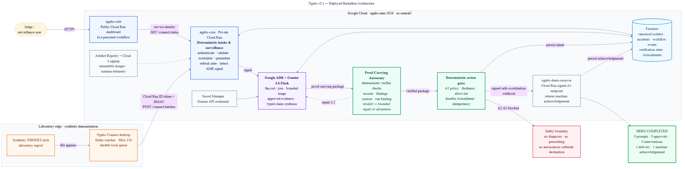

# Ngabo — Judge-Facing Deployed Architecture

**Status:** Deployed v0.1 hackathon submission artifact

**Date:** 2026-09-01

**GCP project:** `ngabo-amr-2026` (`us-central1`)

Submission files:

- [High-resolution PNG](./NGABO_DEPLOYED_ARCHITECTURE.png)
- [Editable Mermaid source](./NGABO_DEPLOYED_ARCHITECTURE.mmd)

## What the Diagram Shows

1. A synthetic WHONET-style laboratory export enters through the local Ngabo Connect desktop client.
2. Ngabo Connect authenticates to the private `ngabo-core` Cloud Run service with an audience-bound Cloud Run identity token and signs the batch with HMAC.
3. Deterministic code validates, normalizes and quarantines records, refreshes canonical state, and detects the AMR surveillance signal.
4. Google ADK orchestrates bounded Gemini 3.6 Flash reasoning over deterministic findings and approved evidence.
5. Proof-carrying claims must pass deterministic record, finding, evidence-source and run-binding checks. Invalid output enters bounded repair or safe abstention.
6. Only a verified package can reach deterministic A1 policy, freshness, allow-list and idempotency gates.
7. Firestore owns canonical isolates, incidents, workflow events, verification state and durable ActionIntents.
8. The signed A1 coordination request reaches `ngabo-demo-receiver`, which returns a machine acknowledgement.
9. The public `ngabo-web` Cloud Run dashboard reads the private core through its own service identity and displays only persisted workflow state.

## Safety Boundary

The deployed synthetic hero can autonomously perform only allow-listed A1 safe coordination. Diagnosis, prescribing, official outbreak confirmation and other A2/A3 actions remain outside the v0.1 autonomous action envelope.

## Submission Truthfulness Note

This diagram describes the deployed Connect deadline slice. Its ingestion request currently starts the workflow directly inside `ngabo-core`; Pub/Sub and Cloud Storage are therefore omitted from this runtime diagram rather than being presented as exercised components. They remain part of the broader event-driven roadmap.

Private chain-of-thought is neither evidence nor canonical incident truth. The UI exposes typed claims, evidence references, verification state and machine acknowledgements instead.
