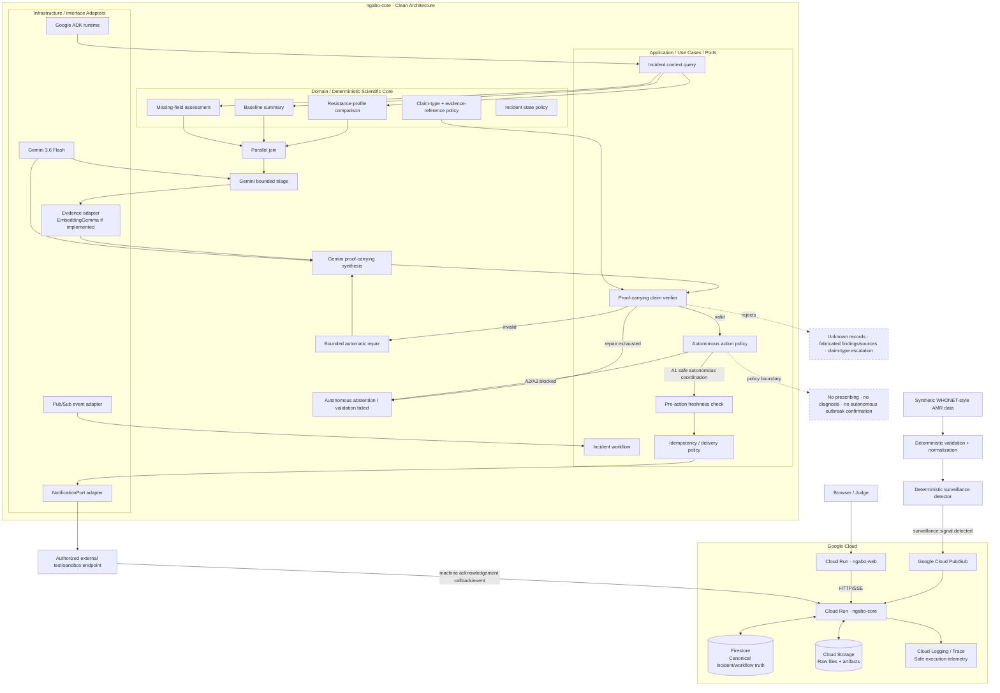

# Ngabo — Judge-Facing Architecture Diagram

**Status:** Required submission artifact; target architecture until deployment freeze  
**Date:** 2026-08-17

This diagram is intentionally optimized for the hackathon judge: it shows autonomous execution, Google technology usage, Clean Architecture boundaries, state ownership, proof-carrying model claims, deterministic verification, safety policy, action and acknowledgement without exposing implementation noise.

> Before submission, update labels/optional model nodes to match the **actually deployed** `v0.1.0` release and export a high-resolution image if Devpost rendering requires one.



## Hero Taskmaster Path

The canonical filmed path is:

```text
signal
→ Pub/Sub
→ ADK graph
→ deterministic fan-out/join
→ Gemini bounded reasoning
→ approved evidence
→ proof-carrying structured claims
→ deterministic claim/evidence verification
→ bounded repair or abstention if invalid
→ A1 autonomous action policy
→ freshness
→ idempotency
→ real external action
→ automated acknowledgement
```

Required hero counters:

```text
manual prompts:       0
human interventions: 0
clarifications:       0
approval clicks:      0
```

## Proof-Carrying Reasoning Boundary

Gemini may interpret, hypothesize and synthesize, but action-relevant claims must reference canonical records, deterministic findings and/or approved evidence. Unknown references, forbidden claim types, unsupported factual assertions and stale package evidence fail deterministic verification.

Private/hidden chain-of-thought is not evidence and is not displayed or persisted as incident truth.

See `docs/PROOF_CARRYING_REASONING.md` and ADR 0009.

## Safety Boundary

The diagram deliberately separates **autonomous coordination** from **clinical/official public-health authority**.

A1 safe coordination actions can execute autonomously only after deterministic claim verification, action-policy, freshness and idempotency gates. A2/A3 action classes are blocked from the zero-human v0.1 lane.

## Google Technology Proof

The final version must truthfully show only technologies that actually execute in the submitted release:

- Gemini 3.6 Flash;
- Google ADK Python;
- Cloud Run;
- Firestore;
- Pub/Sub;
- Cloud Storage;
- Cloud Logging/Trace;
- EmbeddingGemma only if successfully integrated and evaluated;
- MedGemma only if successfully integrated and evaluated.

## Final Export Checklist

- [ ] diagram matches deployed source code;
- [ ] proof-carrying claim verifier is implemented if shown;
- [ ] optional models removed if not implemented;
- [ ] Cloud Run service names match deployment;
- [ ] action/ack endpoint shown accurately;
- [ ] human/clinical safety boundary understandable in <10 seconds;
- [ ] autonomous hero path visually obvious;
- [ ] readable at 1080p video resolution;
- [ ] exported image committed/linked if needed for Devpost.
