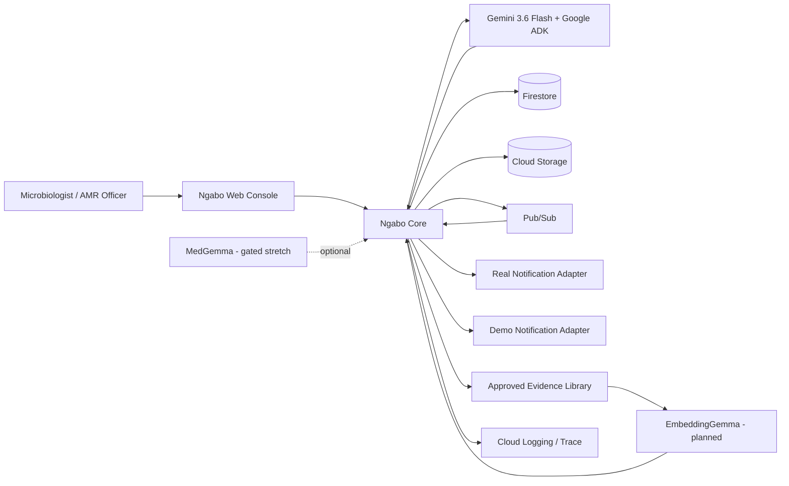
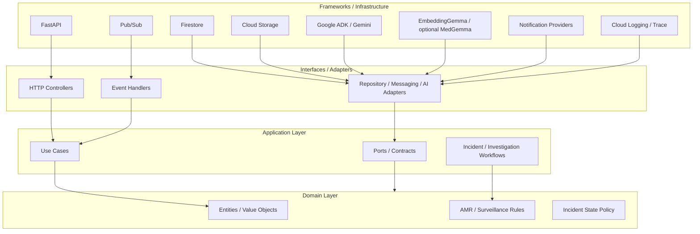
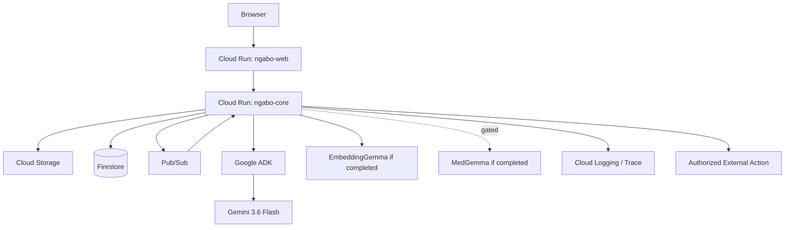
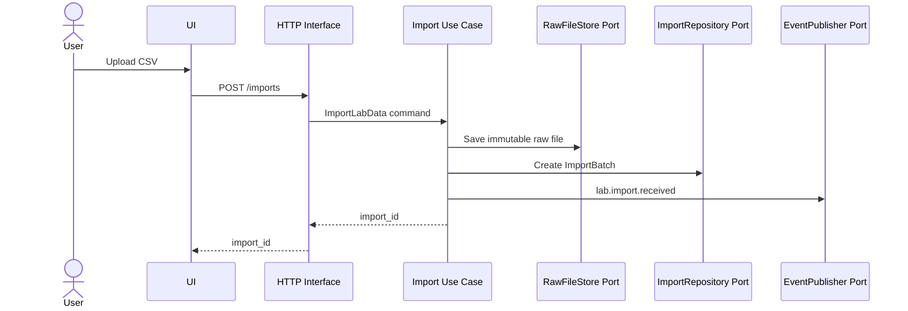
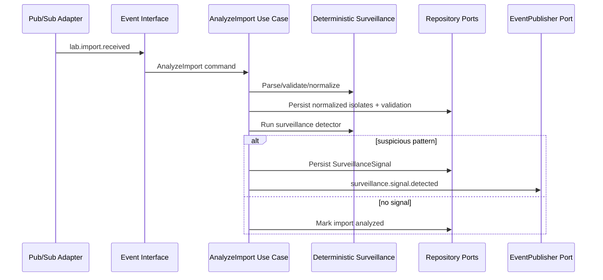
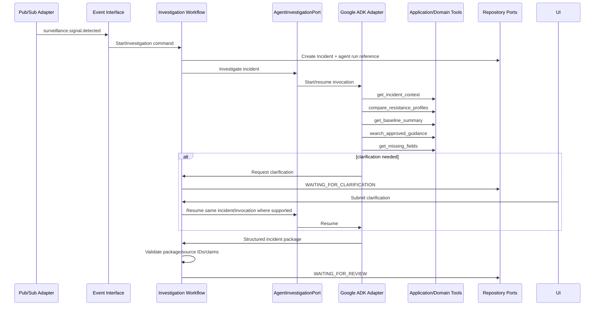
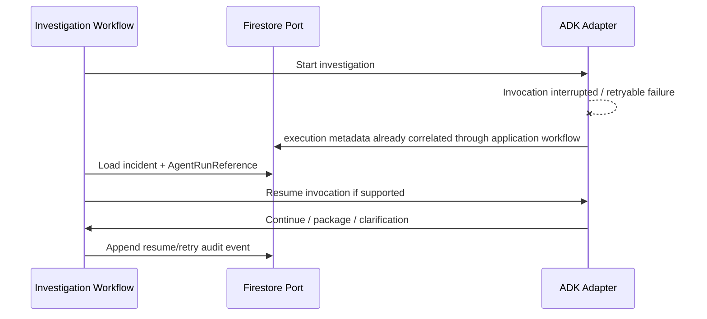
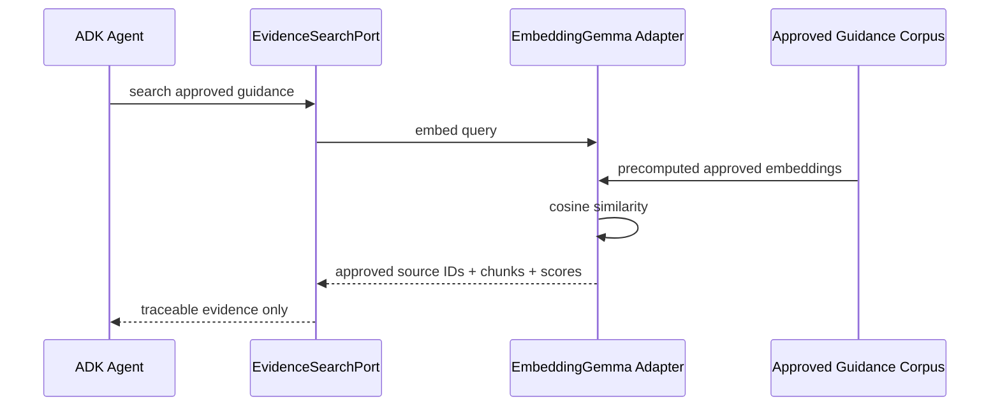
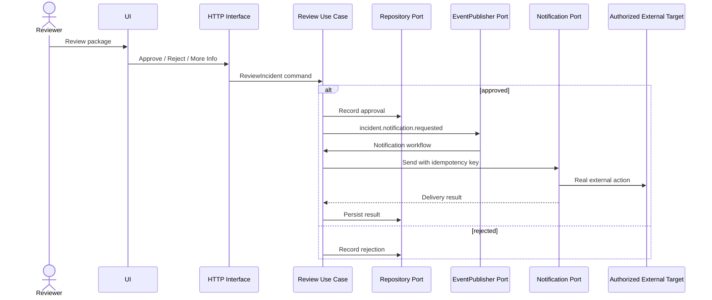
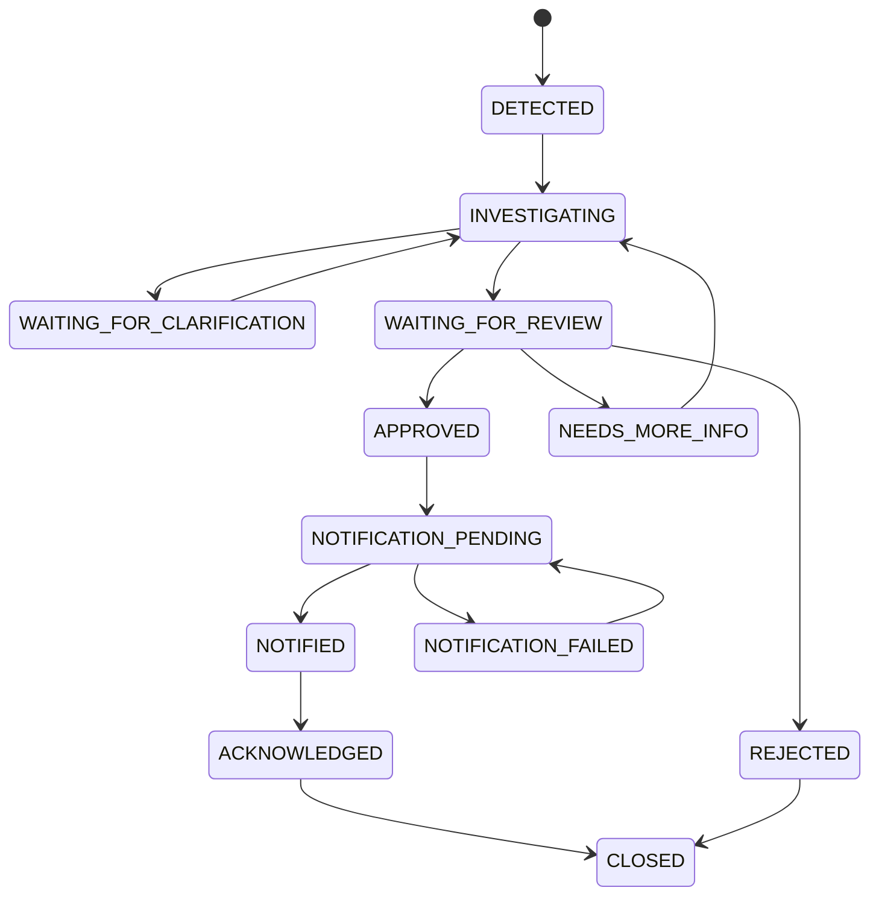

# Ngabo — System Design

**Version:** 0.3  
**Date:** 2026-08-16  
**Status:** Hackathon MVP system design  
**Architecture:** Clean Architecture in a monorepo

## 1. Design Objective

Build the smallest architecture that convincingly demonstrates:

> **event-driven AMR surveillance → autonomous, resumable investigation → human-reviewed response → real observable action**

while preserving deterministic scientific logic, an auditable workflow, strict Clean Architecture dependency boundaries, and strong hackathon proof of execution.

See:

- `docs/CLEAN_ARCHITECTURE.md`
- `docs/HACKATHON_ALIGNMENT.md`
- `docs/ADK_RUNTIME.md`

## 2. Architectural Principles

Ngabo follows these system-wide rules:

1. **Clean Architecture:** dependencies point inward toward domain/application policy.
2. **Monorepo:** frontend, backend, data, infra, docs, tests, and release governance share one repository.
3. **Independent deployables:** monorepo does not collapse `ngabo-web` and `ngabo-core` into one runtime.
4. **Deterministic scientific core:** surveillance calculations remain ordinary reproducible code.
5. **Agentic ambiguity only:** Gemini/ADK handle investigation planning, context, clarification, evidence synthesis, and coordination.
6. **Ports/adapters:** Firestore, Pub/Sub, GCS, ADK, Gemini, EmbeddingGemma, optional MedGemma, and notifications are outer implementations.
7. **Persisted workflow:** Firestore is canonical operational state.
8. **Resumable execution:** ADK execution continuity complements Firestore state where supported/stable.
9. **Bounded autonomy:** human approval gates consequential escalation.
10. **Proof of action:** the hosted demo performs at least one real authorized external action after approval.
11. **Observable autonomy:** logs/traces expose workflow/tool facts without exposing private chain-of-thought.

## 3. System Context



EmbeddingGemma and MedGemma are shown as outer adapters. EmbeddingGemma is planned only after the core deployed path is green; MedGemma is optional and may be omitted.

## 4. Clean Architecture View



The diagram expresses **source-code dependency direction**, not runtime data flow. Inner layers never import outer frameworks/vendors.

## 5. Monorepo / Deployment View

```text
repository
├── apps/web                  Next.js source
├── services/core             Python/FastAPI/ADK source
├── data                      synthetic data, schemas, guidance
├── docs                      product, architecture, ADR, release docs
├── infra                     deployment/configuration
└── .github                   CI/repository automation

runtime
├── Cloud Run: ngabo-web
└── Cloud Run: ngabo-core
```

**One repository; two primary deployables.** Additional deployables require a justified architecture decision.

## 6. Cloud Deployment



### MVP deployment principle

Use one backend deployment with clean internal layers. Split services later only when real scale, fault isolation, or product boundaries justify the operational cost.

### Hackathon deployment controls

Required:

- Cloud Run minimum instances `0` unless a documented exception exists;
- explicit max-instance caps;
- right-sized CPU/RAM;
- Google Cloud budget and email alert;
- Secret Manager/injected secrets;
- protected internal event endpoints;
- judge-accessible hosted service through the required judging window;
- light artifact/log retention appropriate for a demo system.

## 7. Backend Package Boundaries

```text
services/core/ngabo/
├── domain/
│   ├── entities/
│   ├── value_objects/
│   ├── enums/
│   ├── events/
│   ├── exceptions/
│   └── services/surveillance/
├── application/
│   ├── use_cases/
│   ├── workflows/
│   ├── commands/
│   ├── queries/
│   ├── dto/
│   ├── ports/
│   └── agent_contracts/
├── interfaces/
│   ├── api/
│   └── events/
├── infrastructure/
│   ├── persistence/firestore/
│   ├── storage/gcs/
│   ├── messaging/pubsub/
│   ├── ai/gemini/
│   ├── ai/adk/
│   ├── ai/embedding_gemma/
│   ├── ai/medgemma/          # only if stretch accepted
│   ├── evidence/
│   ├── observability/
│   └── notifications/
└── bootstrap/
```

### Layer responsibilities

**Domain** — AMR/surveillance entities, value objects, rules, state policy, pure deterministic services.  
**Application** — use cases, workflows, commands/queries, ports, agent-facing contracts.  
**Interfaces** — HTTP and event translation into application commands.  
**Infrastructure** — Firestore/GCS/PubSub/Gemini/ADK/Gemma/notification/telemetry implementations.  
**Bootstrap** — composition root and dependency wiring.

## 8. Core Domain / Application Records

### ImportBatch
- ID
- raw file URI reference
- SHA-256
- status
- received time
- row counts
- validation summary

### Isolate
Canonical normalized organism/specimen/ward/AST record.

### SurveillanceSignal
Deterministic output indicating a pattern deserves investigation.

### Incident
Long-lived response workflow.

### IncidentEvent
Append-only audit event.

### AgentRunReference
Application-level metadata correlating an incident to agent execution without leaking ADK classes into the domain.

Suggested fields:

```text
incident_id
agent_session_id
agent_invocation_id
agent_run_id
agent_run_status
agent_attempt
started_at
updated_at
last_checkpoint
```

### EvidenceSource
Approved guidance/reference metadata.

### Clarification
Question + human answer/provenance.

### Notification
Outbound action + delivery/ack state.

These concepts must remain meaningful without knowing which database, web framework, agent runtime, or LLM provider is used.

## 9. Import Sequence



At runtime, infrastructure adapters implement the ports with GCS, Firestore, and Pub/Sub.

## 10. Normalization + Detection Sequence



The event handler contains no AMR/scientific logic.

## 11. Agent Investigation Sequence



Google ADK/Gemini are concrete infrastructure implementations behind the application contract. Firestore remains the business/workflow source of truth even when ADK checkpoint/resume is used.

## 12. Interruption / Resume Sequence



All tools must be safe under possible repeated execution. Resumability is not permission to create non-idempotent agent side effects.

## 13. Evidence Retrieval Sequence

Initial core may use deterministic/tag retrieval. Planned post-core semantic retrieval:



No arbitrary web result becomes approved evidence in v0.1.

## 14. Human Review + Real Action Sequence



The real adapter is required for the hosted/filmed v0.1 demonstration. The deterministic demo adapter remains for tests/local usage.

## 15. Incident State Machine



Agent failures/retries are recorded as execution/audit metadata without casually inventing new business states. If implementation needs new incident states, update the domain model and docs explicitly.

## 16. Idempotency

Pub/Sub and resumed agent execution can cause repeated work.

Every event has a unique `event_id`.

Before a state-changing side effect:

1. application workflow applies the idempotency contract;
2. infrastructure persistence performs the required transactional operation where possible;
3. processed-event state is persisted;
4. side effect is not repeated on redelivery.

Notifications use an idempotency key such as:

```text
incident_id + action_type + package_version
```

Read-only agent tools are naturally repeatable. Any state-changing tool must be explicitly idempotent. The agent itself must not directly own consequential external effects.

## 17. Concurrency

Incident has numeric `version`.

Updates require expected version and valid state transition. Conflicts return `409` at the HTTP boundary.

This prevents reviewer approval racing against a still-changing package or a resumed investigation.

## 18. Data Integrity

### Immutable
- raw import file;
- canonical source facts;
- detector configuration used;
- incident event history;
- generated package versions.

### Explicitly mutable through use cases
- current incident state;
- human clarification;
- review decision;
- acknowledgement;
- retryable agent execution metadata.

The agent cannot mutate immutable source facts.

## 19. API Surface

HTTP interfaces expose application use cases.

Imports:
- `POST /api/v1/imports`
- `GET /api/v1/imports/{id}`
- `GET /api/v1/imports/{id}/validation`

Incidents:
- `GET /api/v1/incidents`
- `GET /api/v1/incidents/{id}`
- `GET /api/v1/incidents/{id}/events`
- `POST /api/v1/incidents/{id}/clarifications`
- `POST /api/v1/incidents/{id}/review`

Demo:
- `POST /api/v1/demo/reset`
- `POST /api/v1/demo/run-seeded-scenario`

Private event interfaces:
- `/internal/events/imports`
- `/internal/events/surveillance`
- `/internal/events/incidents`

Routes/controllers remain thin transport adapters.

## 20. Frontend Architecture

```text
apps/web/src/
├── domain/
├── application/
├── infrastructure/
│   ├── api/
│   └── streaming/
├── presentation/
└── app/
```

The Next.js application follows the dependency philosophy pragmatically:

- React/presentation renders state;
- application owns meaningful client-side workflow behavior;
- API/SSE access lives in infrastructure;
- UI never calls GCP/model infrastructure directly;
- Next.js `app/` is route/composition wiring.

See `docs/UI_UX_SPEC.md`.

## 21. Live UI / Demo-Proof Timeline

Preferred: Server-Sent Events for incident state/tool events.

Fallback: short polling if SSE threatens implementation stability.

Public-safe timeline events include:

```text
DATA_NORMALIZED
SURVEILLANCE_SIGNAL_DETECTED
AGENT_INVESTIGATION_STARTED
AGENT_TOOL_STARTED
AGENT_TOOL_COMPLETED
EVIDENCE_RETRIEVED
CLARIFICATION_REQUESTED
CLARIFICATION_RECEIVED
AGENT_INVESTIGATION_RESUMED
INCIDENT_PACKAGE_VALIDATED
REVIEW_APPROVED
NOTIFICATION_SENT
NOTIFICATION_ACKNOWLEDGED
```

These events expose observable workflow facts, not hidden model chain-of-thought.

## 22. Required Failure Behaviors

| Failure | Behavior |
|---|---|
| invalid CSV | visible validation failure |
| unknown organism | flag unknown; never invent mapping |
| missing ward/specimen | persist missingness |
| duplicate Pub/Sub event | no duplicate incident/action |
| Gemini timeout | bounded retry + visible error |
| ADK invocation interruption | safe resume/retry using persisted references where supported |
| tool failure | visible failed/retryable investigation state |
| no guidance result | say evidence unavailable |
| malformed model package | reject with schema validation |
| reviewer rejection | stop action and persist reason |
| notification failure | retryable state with idempotency |
| app restart | resume from persisted application state |
| trace/log unavailable | workflow still functions; observability degrades only |

Errors are translated at outer interfaces; inner layers use domain/application error types rather than framework-specific HTTP exceptions.

## 23. Observability

Every log/event carries where relevant:

- correlation ID;
- incident ID;
- event ID;
- agent session ID;
- agent invocation ID;
- agent run ID;
- tool name;
- package version.

Track:

- import time;
- normalization time;
- detector time;
- agent invocation time;
- tool latency/error;
- retries/resumes;
- clarification count;
- package generation time;
- notification latency;
- model/token usage where available.

Use Cloud Logging plus ADK/Cloud Trace/OpenTelemetry where stable. Prefer metadata/no-content tracing; broad prompt/response capture is not required for the hackathon and should not become the default architecture.

Observability is infrastructure. Domain behavior must not depend on telemetry availability.

## 24. Testing & Evaluation Strategy

### Domain
Pure unit tests without cloud, HTTP, model, or network access.

### Application
Use-case/workflow tests using fakes/in-memory port implementations.

### Infrastructure
Adapter integration/contract tests using emulators/test doubles or controlled integration environments.

### Interfaces
API/event contract tests.

### ADK evaluation
Evaluate both final structured behavior and trajectory/tool use where supported:

- correct tool selection;
- missing-data clarification;
- no-source behavior;
- tool failure;
- prompt injection;
- fabricated citation/isolate rejection;
- overclaiming boundaries.

### End-to-end

```text
upload
  -> deterministic signal
  -> Pub/Sub
  -> investigate
  -> clarify
  -> resume
  -> package
  -> review
  -> real notify
  -> acknowledge
```

The final public `EVALUATION.md` records methodology/results/limitations.

## 25. Architecture Enforcement

Before completing a change, verify:

- domain imports no FastAPI/GCP/ADK/Gemini/Gemma SDK;
- application does not instantiate Firestore/PubSub/GCS/model clients;
- routes/event handlers contain no scientific/business rules;
- ADK wrappers call inward use cases/contracts rather than becoming a parallel business layer;
- deterministic surveillance tests run without external services;
- concrete adapters are wired at composition roots;
- Firestore remains workflow truth even with ADK resume support;
- real notification cannot execute before approval;
- bonus models remain optional outer adapters;
- monorepo boundaries remain intact;
- new deployables/repositories require an ADR.

## 26. Multimodal Stretch Boundary

Only after the core demo is frozen, Gemini multimodal input may extract a **draft** record from a photo/scanned PDF AST report:

```text
image/PDF -> Gemini extraction -> DRAFT -> human verification -> canonical ingestion
```

Model extraction never becomes a canonical lab fact without verification.

## 27. Evolution Path

```text
v0.1.x
Clean Architecture monorepo
Cloud Run + Firestore + Pub/Sub + GCS
Gemini + ADK
resumable investigation
curated/semantic evidence
real approved action
       ↓
0.2–0.5.x
stronger adapters, governance, observability,
real-world evaluation under approved conditions
       ↓
0.9.x / 1.0.0
production-candidate/production-ready hardening
       ↓
research/deeptech extensions
pathogen genomics + AMRFinderPlus
phylogenetics
phenotype/genotype fusion
validated surveillance models
```
