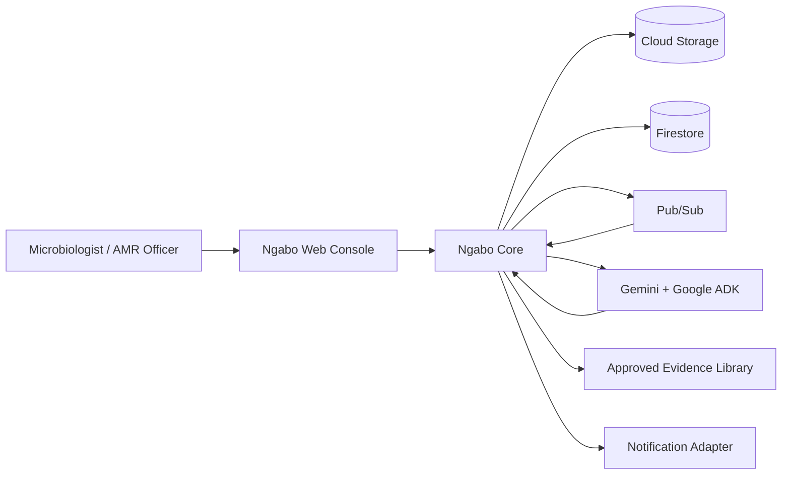
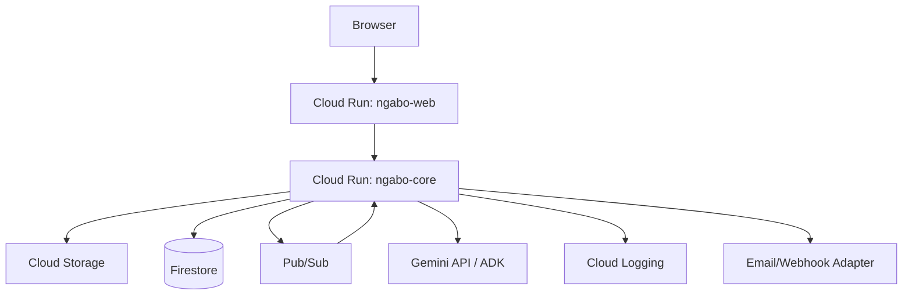
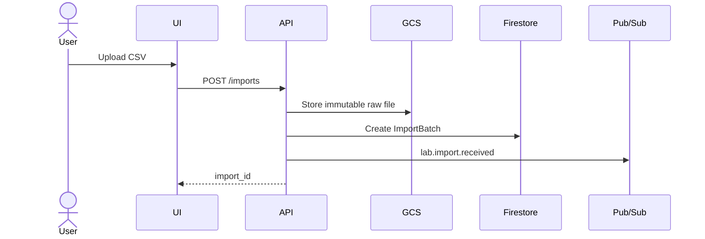
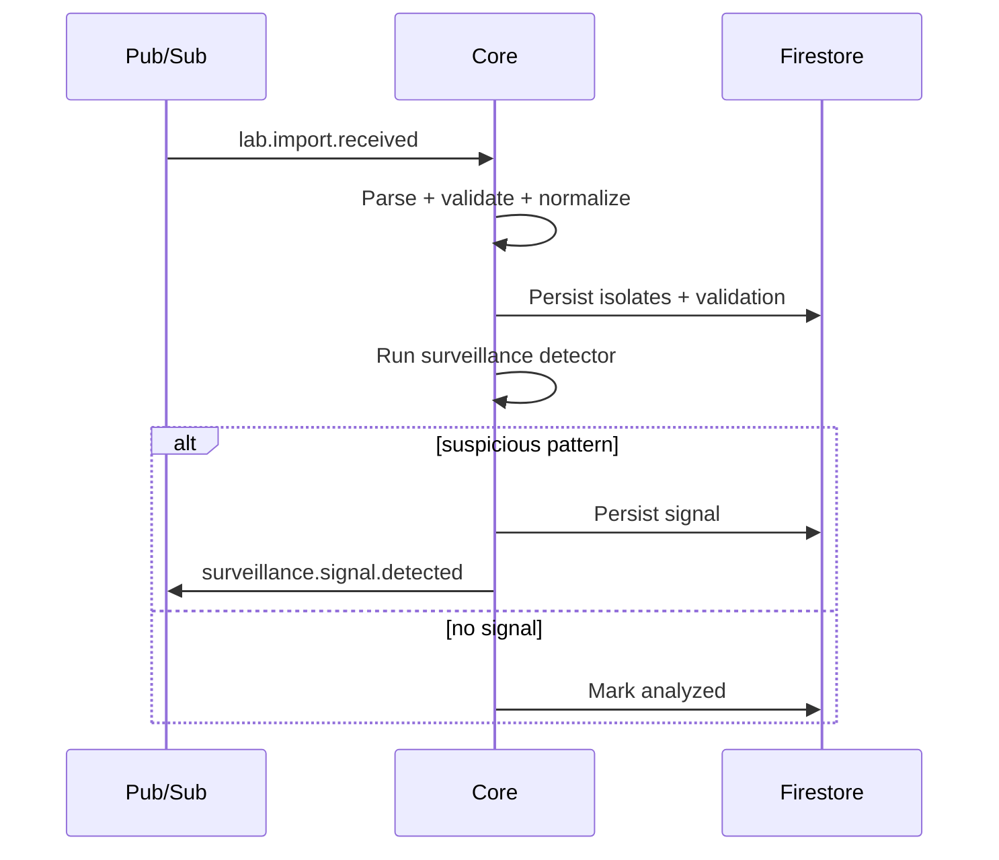
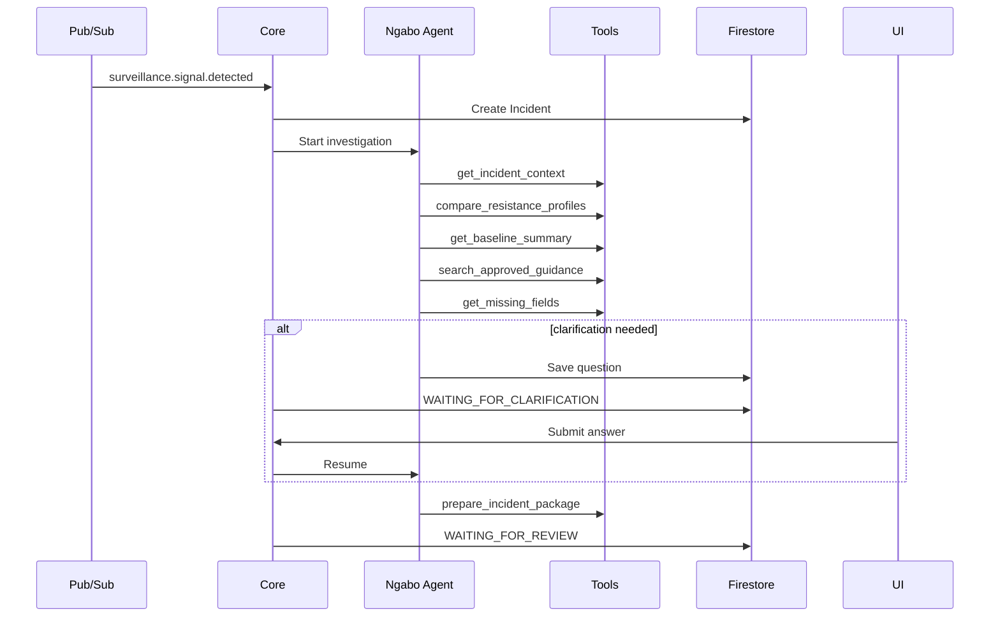
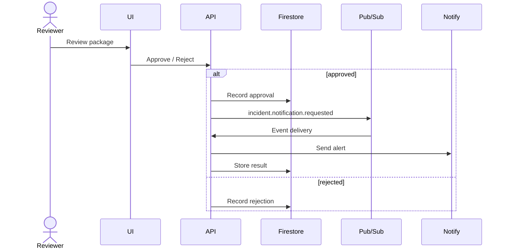
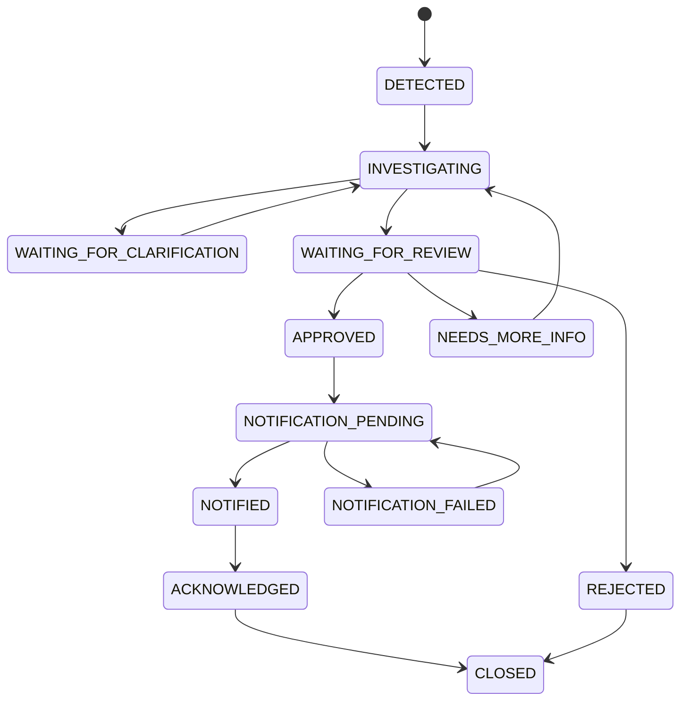

# Ngabo — System Design

**Version:** 0.1  
**Date:** 2026-08-16  
**Status:** Hackathon MVP system design

## 1. Design Objective

Build the smallest architecture that convincingly demonstrates:

> **event-driven AMR surveillance → autonomous investigation → human-reviewed response → observable action**

while preserving deterministic scientific logic and an auditable workflow.

## 2. Context



## 3. Cloud Deployment



### MVP deployment principle

Use one backend deployment but clean internal modules. Split services later only if real scale/fault-isolation requires it.

## 4. Core Entities

### ImportBatch
- ID
- raw file URI
- SHA-256
- status
- received time
- row counts
- validation summary

### Isolate
Canonical normalized organism/specimen/ward/AST record.

### SurveillanceSignal
Deterministic output indicating a pattern deserves investigation.

### Incident
Long-lived response workflow.

### IncidentEvent
Append-only audit event.

### EvidenceSource
Approved guidance/reference metadata.

### Clarification
Question + human answer.

### Notification
Outbound action + delivery/ack state.

## 5. Import Sequence



## 6. Detection Sequence



## 7. Agent Investigation



## 8. Human Review + Action



## 9. Incident State Machine



## 10. Idempotency

Pub/Sub may redeliver events.

Every event has a unique `event_id`.

Before a state-changing side effect:
1. check `processed_events/{event_id}`;
2. perform transition/action transactionally where possible;
3. record processed marker.

Notifications use an idempotency key:

```text
incident_id + action_type + package_version
```

## 11. Concurrency

Incident has numeric `version`.

Updates require expected version and valid state transition. Conflicts return `409`.

This prevents a reviewer approval racing against a still-changing package.

## 12. Data Integrity

### Immutable
- raw import file;
- canonical source facts;
- detector configuration used;
- incident event history;
- generated package versions.

### Explicitly mutable
- current incident state;
- human clarification;
- review decision;
- acknowledgement.

The agent cannot mutate immutable facts.

## 13. API Surface

Imports:
- `POST /api/v1/imports`
- `GET /api/v1/imports/{id}`
- `GET /api/v1/imports/{id}/validation`

Incidents:
- `GET /api/v1/incidents`
- `GET /api/v1/incidents/{id}`
- `GET /api/v1/incidents/{id}/events`
- `POST /api/v1/incidents/{id}/clarifications`
- `POST /api/v1/incidents/{id}/review`

Demo:
- `POST /api/v1/demo/reset`
- `POST /api/v1/demo/run-seeded-scenario`

Private event endpoints:
- `/internal/events/imports`
- `/internal/events/surveillance`
- `/internal/events/incidents`

## 14. Live UI

Preferred: Server-Sent Events for incident state/tool events.

Fallback: short polling if SSE costs implementation stability.

## 15. Required Failure Behaviors

| Failure | Behavior |
|---|---|
| invalid CSV | visible validation failure |
| unknown organism | flag unknown; never invent mapping |
| missing ward/specimen | persist missingness |
| duplicate Pub/Sub event | no duplicate incident/action |
| Gemini timeout | bounded retry + visible error |
| tool failure | visible failed investigation state |
| no guidance result | say evidence unavailable |
| malformed model package | reject with schema validation |
| reviewer rejection | stop action and persist reason |
| notification failure | retryable state |
| app restart | resume from persisted state |

## 16. Observability

Every log/event carries where relevant:
- correlation ID;
- incident ID;
- event ID;
- agent run ID;
- tool name.

Track:
- import time;
- normalization time;
- detector time;
- agent/tool latency;
- clarification count;
- package generation time;
- notification latency.

## 17. Evolution Path

```text
v0.1:
Cloud Run + Firestore + Pub/Sub + GCS
curated evidence
phenotype surveillance
       ↓
v1:
RBAC + real connectors + stronger analytics
       ↓
research/deeptech:
genomics + AMRFinderPlus
phylogenetics
phenotype/genotype fusion
validated outbreak models
```
